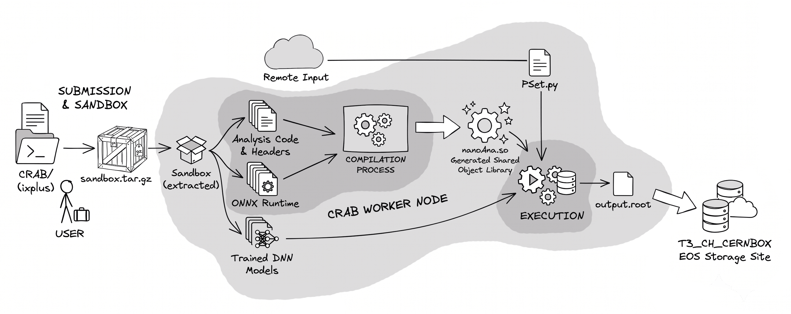

# Run the analysis with CRAB

This directory contains the setup for running the analysis in bulk over CMS DAS samples using CRAB.

CRAB (CMS Remote Analysis Builder) is the CMS tool used to submit analysis jobs to the Grid. While REANA distributes the steps of an analysis workflow, which can involve general computational tasks, CRAB is specifically designed to distribute the processing of CMS dataset files across Grid worker nodes. REANA is useful for preserving and reproducing an analysis workflow, while CRAB is designed for large-scale CMS data processing, where many independent jobs need to be submitted and processed in parallel. This makes CRAB particularly useful for running the same analysis independently over a large number of NanoAOD files in the Grid.

More information on CRAB is available in the [CRAB documentation](https://cmscrab.docs.cern.ch/index.html).

Instead of processing a large NanoAOD dataset directly on lxplus, CRAB splits the dataset into smaller jobs. In the current setup, each job processes exactly one NanoAOD ROOT file, allowing the files to be processed independently and in parallel. The basic workflow is as follows.
```text
DAS dataset
v
CRAB splits into files
|
+---- file1.root -> job 1
+---- file2.root -> job 2
+---- file3.root -> job 3
+---- ...
v
output.root files
```
Each worker runs the same analysis code with a different input file. Once a job finishes, the resulting `output.root` file is transferred to the configured EOS storage area.

the configuration CRAB crab_script.sh  # runs on the remote worker node and executes C.

compile_and_run samples.json    # contains the datasets and settings 
analysis submitJobs.py   # reads the DAS samples and submits the CRAB jobs
```

<p align="center">  </p>

The CRAB commands need to run inside a CMSSW environment. The analysis code itself does not have any CMSSW dependency. The CMSSW environment is only needed here because CRAB and some of its supporting Python modules are provided through the CMS software environment. A valid CMS grid proxy is also required so that the jobs can access the CMS data:
```bash
voms-proxy-init --voms cms
```
The `samples.json` file is the main place where the datasets are configured. The rest of the CRAB setup is kept generic, so adding another dataset normally only requires adding another entry to this file. A sample entry looks like this:
```python
{
  "dyv12": { # becomes the job identifier
      "dataset": "/DYto2L-4Jets_MLL-50_TuneCP5_13p6TeV_madgraphMLM-pythia8/Run3Summer22NanoAODv12-130X_mcRun3_2022_realistic_v5-v3/NANOAODSIM",
      "era": "2022-postEE",   # passed to era in the analysis _setup, which also sets _year
      "sample": "DYJetsToLL", # passed to sample in the analysis _setup, which also sets _data
      "outdir": "DYto2L"      # sub-directory in EOS
  }
}
```
These parameters are passed to the shell executable `crab_script.sh` through `submitJobs.py` and `crab_config.py`. Here `submitJobs.py` is the main driver, which reads `samples.json`, creates the sandbox containing the analysis code, checks that the configured datasets exist in DAS, and submits the CRAB requests. The dataset-specific information is passed to `crab_config.py` through environment variables:
```text
CRAB_ERA
CRAB_SAMPLE
CRAB_DATASET
CRAB_OUTDIR
```
This is what makes `crab_config.py` reusable for all samples. The same configuration file is used for every submission, while `submitJobs.py` sets these environment variables differently for each sample.

The worker node needs the analysis code, but there is no need to copy the full repository. `submitJobs.py` creates a sandbox containing the main C++ analysis files, all associated headers, the ONNX Runtime library, and the trained DNN models. The directory structure required by the analysis is preserved inside the sandbox so that the same analysis setup can run on the worker node.

The submission script by default is designed to run in dry-run mode first to check the configuration without actually submitting the jobs:
```bash
python3 submitJobs.py
```
The actual submission is enabled with:
```bash
python3 submitJobs.py --dryrun False
```

## More on CRAB

The actual CRAB configuration is kept in `crab_config.py` . The important part is that dataset-specific values are not hardcoded in this file. Instead, they are read from the environment variables set by `submitJobs.py`.

```python
era     = os.getenv('CRAB_ERA', '2022')
sample  = os.getenv('CRAB_SAMPLE', 'DYJets')
reqname = os.getenv('CRAB_REQNAME', 'nanoAna_test')
dataset = os.getenv('CRAB_DATASET', '/dummy/dataset')
outdir  = os.getenv('CRAB_OUTDIR', 'Uncategorized')
```
The CRAB job is configured as an `Analysis` job:
```python
config.JobType.pluginName = 'Analysis'
config.JobType.psetName   = 'PSet.py'
config.JobType.scriptExe  = 'crab_script.sh'
```
The template, `PSet.py` is used because CRAB expects a CMSSW ParameterSet, while `crab_script.sh` is the actual executable that runs the analysis. The analysis-specific arguments are passed to `crab_script.sh` through `scriptArgs`:
```python
config.JobType.scriptArgs = [f"era={era}", f"sample={sample}"]
```
The sandbox and output file are configured as:
```python
config.JobType.inputFiles = ['sandbox.tar.gz']
config.JobType.outputFiles = ['output.root']
```
**The name `output.root` is important** because CRAB expects the file listed in `config.JobType.outputFiles` to be created by the job. The worker script therefore always writes the analysis result to `output.root`, regardless of the input dataset or input filename. CRAB then knows which file needs to be transferred from the worker node to the configured storage site.

For job splitting, the current configuration uses:
```python
config.Data.splitting = 'FileBased'
config.Data.unitsPerJob = 1
```
This means that one input NanoAOD file corresponds to one CRAB job. For example, a dataset containing 500 NanoAOD files will result in roughly 500 CRAB jobs. Each job processes its assigned file independently, which is a natural fit for NanoAOD analysis because there is normally no need for one input file to communicate with another during event processing.

The output storage site is configured as:
```python
config.Site.storageSite = 'T3_CH_CERNBOX'
```
This sends the output files to the configured EOS-backed storage area.

### What happens on the worker node?

The actual execution on the worker node is handled by `crab_script.sh`. The complete flow is:
```text
> CRAB worker node
> receive sandbox.tar.gz
> extract sandbox
> read input file from PSet.py
> build ROOT command
> run compile_and_run.C
> create output.root
> transfer output to storage
```
CRAB passes the values defined in `config.JobType.scriptArgs` to `crab_script.sh`. The shell script converts these arguments into variables that are then available to the analysis:
```bash
$era
$sample
```
The sandbox is first extracted on the worker node, where the analysis source files, headers, ONNX Runtime library, and trained DNN models are available in the same directory structure as in the repository. This is important because the analysis code expects these files to be in their original relative paths.

CRAB also fills `PSet.py` with the input file assigned to that particular job. The script reads the first file from the CRAB-generated file list:
```bash
infile=$(python3 -c "import PSet; print(PSet.process.source.fileNames[0])")
```
For example, `infile` might contain:
```text
/store/mc/Run3Summer22NanoAODv12/.../file123.root
```
The NanoAOD file itself is not copied into the sandbox. It remains in CMS storage and is accessed remotely through XRootD. This keeps the sandbox small and avoids transferring the input ROOT file as part of the CRAB job.

Finally, the shell script constructs the ROOT command:
```bash
root_command="compile_and_run.C(\"root://cms-xrd-global.cern.ch//$infile\",\"$outfile\", \"$era\", \"$sample\")"
```
The `compile_and_run.C` macro is designed to take all required information through its shell arguments. The `$sample` argument determines whether the analysis is running on data or MC. In the analysis code, sample names such as `Muon`, `EGamma`, or `SingleElectron` set `_data = 1`. Similarly, `$era` is passed to the analysis and is used to set the corresponding era and year configuration.

The command is then executed with:
```bash
root -q -b -l "$root_command"
```
A typical CRAB job therefore effectively runs the following on the worker node:
```text
compile_and_run.C(input_file, "output.root", "2022-postEE", "DYJetsToLL")
```
where the input file is accessed through:
```text
root://cms-xrd-global.cern.ch/
```
Since `compile_and_run.C` is called with a fixed set of arguments, any change to its arguments or their order also needs to be reflected in the CRAB setup, particularly in `crab_script.sh`. Also, the input NanoAOD file remains in CMS storage and does not need to be included in `sandbox.tar.gz`.

### Why is `PSet.py` needed?

CRAB expects every job to have a CMSSW ParameterSet, even though the analysis itself is not implemented as a CMSSW module. `PSet.py` is therefore kept as a minimal configuration that provides the input file information required by CRAB.

The current `PSet.py` contains:
```python
import FWCore.ParameterSet.Config as cms
process = cms.Process("NANO")
process.maxEvents = cms.untracked.PSet(input=cms.untracked.int32(-1))
process.source = cms.Source("PoolSource", fileNames=cms.untracked.vstring())
```
Here, `cms.Process("NANO")` defines a minimal CMSSW process, while `maxEvents = -1` allows all events in the input file to be processed. The `PoolSource` defines the input ROOT files, but the `fileNames` list is initially empty.  CRAB fills `process.source.fileNames` with the NanoAOD file assigned to each job. `crab_script.sh` then reads this list and passes the input filename to `compile_and_run.C`. `PSet.py` does not contain any analysis logic in this setup. It is only used to provide the CMSSW configuration expected by CRAB and to make the job's input file available to `crab_script.sh`.


## Monitoring and managing jobs

The helper script `displayStatus.py` can be used to check the status of the submitted tasks:
```bash
python3 displayStatus.py
```
A specific CRAB task can also be checked directly with:
```bash
crab status -d submitted/<request-directory>
```
Submitted jobs can be stopped using:
```bash
python3 killAllJobs.py
```
For a specific task, the corresponding CRAB command is:
```bash
crab kill -d submitted/<request-directory>
```
