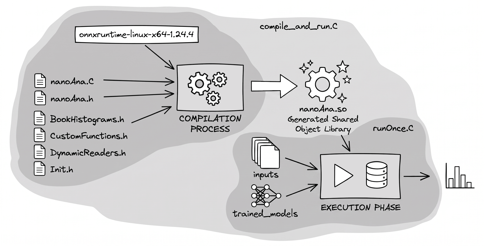

# NanoAOD analysis template using dynamic typecasting

  

Handling different versions of NanoAOD can be challenging due to evolving data types and changing branch names across production campaigns. Because ROOT's `TTreeReaderValue` and `TTreeReaderArray` are strictly typed, version transitions often break analysis frameworks.
This template fixes that using **dynamic typecasting**. Here is what it brings to the table:
- **Auto-adapts to versions:** It automatically detects the correct branch types and looks for fallback names during setup. No need to rewrite the core logic every time a NanoAOD version changes.

- **Live DNN evaluation:** It has ONNX baked in (with an example DNN). Pre-trained neural networks can be run event-by-event for on-the-fly event selection and categorization.

- **Plug-and-play ONNX:** To completely avoid annoying environment and setup issues, I just dropped a pre-compiled ONNX runtime directly into the repo and hardcoded the paths. No need to build from source
> For more details on the C++ API, check out the [official ONNX Runtime docs](https://onnxruntime.ai/docs/).<br>
> **For users outside the CMS Collaboration:** NanoAOD samples are available through the [CERN Open Data Portal](https://opendata.cern.ch/docs/cms-getting-started-nanoaod).

## Structure
```bash
├── nanoAna.C            # Source code containing the analysis logic
├── nanoAna.h            # Primary header containing the analyzer class
├── headers              # Additional headers to avoid messy nanoAna.h
│   ├── BookHistograms.h    # -> Defines the histograms
│   ├── CustomFunctions.h   # -> Helpul functions
│   ├── DynamicReaders.h    # -> Handles nanoAOD branch types
│   └── Init.h              # -> Initializes the branch variables from input file
├── onnxruntime-linux-x64-1.24.4    # Library for DNN compatibility
├── trained_models       # Trained DNNs and input scaling parameters
├── inputs
├── outputs
├── runOnce.C            # Driver that runs the compiled setup.
└── compile_and_run.C    # Wrapper around the driver; handles library loading and compilation
```
Here is how the pieces fit together during a run:

<p align="center">  </p>

- **Compilation:** The pre-compiled ONNX shared libraries are first loaded into ROOT, followed by the compilation of the main analyzer (`nanoAna.C` and its modular headers) into a shared object.

- **Execution:** Once compiled, the `runOnce.C` driver script gathers the inputs (including the DNN models), feeds them to the analyzer, and initiates the event loop. The code dynamically reads the branches, evaluates the DNN on the fly, and saves the final histograms into the `outputs/` directory.

## How to compile and run

Executing the analysis requires the core `.C` file, its modular headers, and the ONNX module. The easiest way to run the analysis is by using the provided wrapper `compile_and_run.C`, which handles library loading, compilation, and standard I/O management behind the scenes.
```bash
root -l compile_and_run.C
```
-   Manages input/output paths as provided in the script.
-   Accepts additional parameters such as the `sample` name and data-taking `era`.
-  Setting the `sample` parameter to a string containing `"Muon"`, `"EGamma"`, or `"Electron"` will automatically set the internal `_data = 1` flag.

### What is happening under the hood
To understand the underlying mechanics or to debug the compilation process, the setup can be compiled and executed manually inside an interactive ROOT session.
```bash
root -l
```
Inside the ROOT prompt, load the required ONNX libraries using relative paths:
```cpp
gSystem->AddIncludePath("-Ionnxruntime-linux-x64-1.24.4/include");
gSystem->AddLinkedLibs("-Wl,-rpath,onnxruntime-linux-x64-1.24.4/lib onnxruntime-linux-x64-1.24.4/lib/libonnxruntime.so");
gSystem->Load("onnxruntime-linux-x64-1.24.4/lib/libonnxruntime.so");
```
Compile the main analyzer class to generate the shared library (`nanoAna_C.so`):
```cpp
.L nanoAna.C+
```
Execute the macro driver, providing your specific input arguments:
```cpp
.x runOnce.C("inputs/DY_NanoAODv15.root", "outputs/hst_test.root", "2024", "DYJetsToLL")
```

## How to customize the branches

Before starting, it is helpful to inspect the `Events` tree in the input NanoAOD file to verify the exact branch names. The details are also available at [NanoAOD content self-documentation](https://cms-xpog.docs.cern.ch/autoDoc/) [restricted to CERN members].

### Declare the variable name

In the main header file (`nanoAna.h`), the variable names and their intended types must be declared. At this stage, they are not yet connected to the input file. The type defined here dictates the internal typecasting, so compatible types must be chosen (e.g., avoiding incompatible conversions like string to int). These declared names are what will be used throughout the core analysis code.
```cpp
  DynamicValueReader<int> nElectron;
  DynamicArrayReader<bool> Electron_convVeto;
  DynamicArrayReader<int> Electron_cutBased;
  DynamicArrayReader<bool> Electron_cutBased_HEEP;
  DynamicArrayReader<bool> Electron_mvaIso_WP80;
```

### Initialize the variable to connect it to the NanoAOD branch

Next, over in the `headers/Init.h` file, these variables get initialized and mapped to the actual NanoAOD branch names. This step is what actually connects the local variables to the input data.
```cpp
  nElectron.Init(tree, fReader, "nElectron", 0);
  Electron_convVeto.Init(tree, fReader, "Electron_convVeto");
  Electron_cutBased.Init(tree, fReader, "Electron_cutBased");
  Electron_cutBased_HEEP.Init(tree, fReader, "Electron_cutBased_HEEP");
  Electron_mvaIso_WP80.Init(tree, fReader, "Electron_mvaIso_WP80");
```
The `Init` method binds the variable to the input tree. It takes the target tree pointer, the `fReader` object (which is the standard `TTreeReader` handling the event loop iteration), the expected branch name or list of alternatives, and an optional fallback value.
> Behind the scenes, all the heavy lifting is handled by `DynamicValueReader` and `DynamicArrayReader` defined in `headers/DynamicReaders.h`. These wrappers inspect the file's leaf types on the fly and cast them safely, preventing the hard crashes that usually happen when a NanoAOD version changes an underlying type (like going from a `Int_t` to a `UInt_t`).

### Tricks that make this setup useful

**Multiple branch names:** The setup allows passing a list of potential branch names to deal with naming shifts between production campaigns (like Run 2 vs. Run 3). In the example below, if the first name is missing, the code just falls back to the second. If both are missing, it spits out the fallback value (`0.0`). No matter which name actually exists in the ROOT file, the variable is always called `fixedGridRhoFastjetAll` inside the main analysis loop.
```cpp
fixedGridRhoFastjetAll.Init(tree,fReader,{"Rho_fixedGridRhoFastjetAll","fixedGridRhoFastjetAll"},0.0);
```
**Smart fallback:** The best (and worst) part of this setup is that the compiled code will not automatically break during runtime if a branch happens to be missing in the input file, which can easily result in a silent bug in the logic. That is exactly why using the right fallback option is crucial. Deciding whether to pass a default fallback value changes how the reader behaves when a branch goes missing:

- **Strict mode (no fallback provided):** If a required branch is missing and no fallback value was given during initialization, accessing it later in the analysis throws a bright red `std::runtime_error`. This avoids the silent bugs. This strictness is often completely intentional for safety. For example, a missing MVA score should absolutely trigger a crash rather than silently evaluating to a default value.
    
- **Safe skipping (fallback set to zero):** For MC-only variables like `nGenPart`, passing a default of `0` means running over data won't break anything. The branch is missing, and `nGenPart` safely evaluates to `0`, and any gen-level loops skip themselves. This trick allows the exact same `fReader` to handle both data and MC seamlessly. While throwing in an `if(_data == 0)` check is still recommended for good measure, maintaining separate readers or editing the source code for data runs is no longer required!
    
- **Neutral fallbacks (weight variables):** Within the same NanoAOD version, samples like QCD often drop LHE-weight branches. Providing a neutral fallback like `1.0` avoids recompiling or hacking up the core code while keeping math operations mathematically safe.
	```cpp
	LHEWeight_originalXWGTUP.Init(tree, fReader, "LHEWeight_originalXWGTUP", 1.0);
	```
---
I hope this template is useful for anyone working with NanoAOD across different production campaigns. The main goal is to make the analysis framework more flexible and reduce the amount of version-specific code needed when branch names or data types change.

If you encounter any issues or have suggestions for improvements, feel free to reach out or open an issue. Contributions and ideas are always welcome!

**Prachurjya Hazarika**  <br>
 
