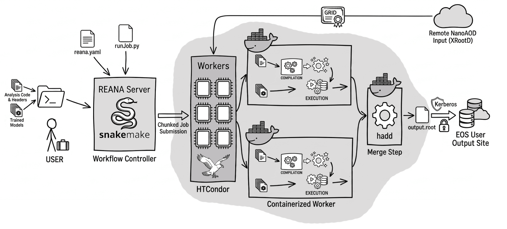

# Run the analysis with REANA

REANA is a tool made at CERN to run physics analyses in the cloud. Instead of running heavy scripts directly on an lxplus terminal, REANA takes the code and runs it on CERN's large computing clusters. It uses containers to bundle up all the required ROOT and CMS software and dispatches jobs to batch systems. This operates similarly to GitLab CI/CD but is optimized specifically for physics workloads. Check out the main documentation page: [https://docs.reana.io/](https://docs.reana.io/)

The configuration shared in this example utilizes **Snakemake** as the workflow management engine. It reads the workflow definition to build a dependency graph, figuring out which Condor jobs can run in parallel, when to merge chunks, and when to publish to EOS. The actual ROOT macros execute on the **HTCondor** compute backend. Final merged files are saved natively to the **EOS storage** backend using a **Kerberos** keytab.

### Prerequisites

- Access to CERN lxplus.
- Access to CMS DAS (a valid grid certificate).

## How it works
```
nanoAOD-dynamic
├── reana
│   ├── prepare.py    # prepares the input file lists
│   ├── samples.json  # contains the datasets and analysis settings
│   ├── Snakefile     # defines the REANA workflow
│   ├── runJob.py     # runs the analysis for each input file in the worker nodes
│   └── submit.sh     # submits the workflow to REANA
└── reana.yaml        # REANA workflow configuration
```
<p align="center">  </p>

### The Physics Core

The actual physics processing happens in C++. `compile_and_run.C` starts things off by taking the XRootD file path, the sample era, and the output name, and then it fires up the `nanoAna` event processor. To run the machine learning models during the event loop, the ONNX C++ API from the `onnxruntime` folder is loaded straight into ROOT. This lets the code evaluate the DY models from the `trained_models` directory on the fly.

### The REANA Infrastructure

The REANA side handles getting jobs to the grid. It starts with `reana/samples.json`, a master list of dataset names, eras, and parameters. Running `reana/prepare.py` locally queries DAS for the actual XRootD URLs and spits out individual JSON files into the `reana/samples/` directory. Keeping these separate lets Snakemake process each sample independently, meaning a single failure does not require restarting everything.

The HTCondor worker nodes execute `reana/runJob.py`. This Python wrapper restricts ONNX and OpenMP to a single thread to stop Condor from freezing up. It also fixes symlinks, sets up the grid proxy, and passes chunks of files to the C++ macro. It relies on the Python `os` module to check for files and clean up the proxy afterward.

The workflow steps are mapped out in `reana/Snakefile`. It defines three stages: processing chunks on Condor, merging the ROOT files with `hadd`, and copying the final data to EOS using Kerberos. Finally, `reana.yaml` just tells REANA which local files and folders need to be sent to the cloud workspace.

## Setting up REANA [one-time setup]

First, a command-line access token is needed to talk to the servers. 
1. Go to [https://reana.cern.ch/](https://reana.cern.ch/) and log in. (This site also acts as a dashboard to check on jobs later).
2. Request access. (Someone has to approve this, so it might take a few hours).
3. Once approved, grab the access token from the web profile.

Next, create a local `.env` file inside the `reana/` folder. **Never commit or push this file to Git.**
```bash
export REANA_SERVER_URL=[https://reana.cern.ch](https://reana.cern.ch)
export REANA_ACCESS_TOKEN=XXXXXXXXXXXXXXXXXXXXXXX
```
Source this file so the terminal knows the token. (This can also just be added to a `.bashrc`). Now, activate the Python environment and load the tokens:
```bash
source /afs/cern.ch/user/r/reana/public/reana/bin/activate
source .env
reana-client ping
```
### Configure EOS Access (Kerberos)

To save final outputs directly to EOS, REANA needs a Kerberos keytab. This allows background worker jobs to securely authenticate, ensuring jobs can complete and write data at any time without manual password prompts.

On `lxplus`, generate this file securely:
```bash
cern-get-keytab --keytab mykeytab.keytab --user --login phazarik
```
Test the keytab locally:
```bash
kdestroy
kinit -kt mykeytab.keytab phazarik@CERN.CH
klist
```
Upload it to REANA as a secret so the HTCondor backend can use it. The `CERN_KEYTAB` environment variable is explicitly set so the workflow engine knows exactly what filename to look for:
```bash
reana-client secrets-add \
  --env CERN_USER=phazarik \
  --env CERN_KEYTAB=mykeytab.keytab \
  --file mykeytab.keytab \
  --overwrite
```
Finally, delete the local file to keep the workspace secure:
```bash
rm mykeytab.keytab
```
> Note: REANA's built-in VOMS proxy secrets manager is bypassed due to a bug where the HTCondor adapter drops the proxy file. Instead, the proxy is generated and transferred securely during submission.

## Running the analysis

### Set up the environment

Activate the virtual environment and load the access tokens from the `.env` file. This authenticates the local terminal session with the central REANA server. Then ping the server to verify the connection is active:
```bash
source /afs/cern.ch/user/r/reana/public/reana/bin/activate
source .env
reana-client ping
```

### Pick an HTCondor submission machine

HTCondor uses multiple schedulers to balance the job load across the cluster. Before submitting, check the status of the available schedulers to find one that is not overloaded with running or held jobs.
```bash
condor_status -schedd
```
Select a machine with a manageable queue and set it as the active scheduler.
```bash
myschedd set bigbird18.cern.ch # replace it with your choice.
myschedd show
condor_q
```
Now, the submission actually happens through HTCondor.
Since the setup uses grid-proxy, the proxy file needs to be available in the worker node.

### Tuning the workflow

Before kicking off the submission, revisit the workflow parameters in `reana/Snakefile` to ensure the requirements.

- **`CHUNK_SIZE`**: Sets the number of ROOT files per HTCondor job. Use 1 for testing and 20-50 for production. Grouping files reduces Condor startup overhead, maximizes actual analysis time, and prevents a flood of tiny jobs from overwhelming REANA and the CERN schedulers.
    
- **`kubernetes_memory_limit`**: Set to `4G` in the chunk processing rule. This provides enough memory overhead for ONNX model loading and ROOT DataFrame operations, preventing the Condor batch system from suddenly killing jobs due to memory limit violations.

### Submission
First, generate the complete list of files by running the local Python script. This queries DAS and builds the dataset JSON configurations inside the `reana/samples/` directory. For quick testing, leave just one JSON file in this directory with a couple of example files.
```bash
python3 prepare.py
```
To submit the jobs to the cluster, a helper script manages the grid proxy and the REANA client commands in the background.
```bash
bash submit.sh nanoaod-run-proxy
```

## What `submit.sh` actually does (security & execution)

Grid credentials are crucial for direct read access to CMS datasets. The official REANA documentation recommends uploading these proxies as secrets ([https://docs.reana.io/advanced-usage/access-control/voms-proxy/](https://docs.reana.io/advanced-usage/access-control/voms-proxy/)):
```bash
reana-client secrets-add --env VONAME=cms \
                         --env VOMSPROXY_FILE=x509up_u1000 \
                         --file /tmp/x509up_u1000
```
However, this setup bypasses the official method. The REANA HTCondor adapter currently **might have a bug where it drops the proxy file**, leaving worker nodes without grid access.

Instead, this workflow treats the proxy as a standard input file and ships it directly to the worker nodes. To ensure the proxy is never left exposed, `submit.sh` and the Python wrapper enforce strict cleanup routines. The credential is wiped from the local disk the second the submission finishes, and it is deleted from the worker node's scratch space the moment the job completes.

First, the script generates a fresh 96-hour grid proxy. For reference, the manual terminal command looks like this:
```bash
voms-proxy-init --cert ~/.globus/usercert.pem \
                 --key ~/.globus/userkey.pem \
                 --voms cms --valid 96:00
```
Then it directly copies the proxy to the root directory as `proxy.pem`. This forces `reana.yaml` to package it as a standard input file, relying on Condor's native, secure file transfer.
```bash
REPO_ROOT="$(cd "$(dirname "$0")/.." && pwd)"
cp "$PROXY" "$REPO_ROOT/proxy.pem"
```
Once the proxy is staged, the workflow is pushed to the REANA client. Under the hood, this happens in several stages from the directory where `reana.yaml` sits:
```bash
reana-client validate                    # Checks the reana.yaml file for any syntax errors
reana-client create -n nanoaod-run       # Creates the workflow space on the server (-n example name)
reana-client create -w nanoaod-run-test  # Creates a specific workflow space for a test run
reana-client upload -w nanoaod-run-test  # Pushes files to the cloud workspace
reana-client start -w nanoaod-run-test   # Triggers the HTCondor batch system to begin execution
```
Alternatively, the REANA client can handle all of this in a single command, which is what the helper script uses:
```bash
reana-client run -w nanoaod-run
```
Immediate cleanup follows. The script deletes the local `proxy.pem` right after submission, so sensitive credentials do not linger on the local lxplus disk. On the worker node side, `runJob.py` secures the proxy permissions to `0o600` to silence XRootD TLS warnings. When the analysis finishes, it uses the `os` module to permanently delete the proxy from the Condor scratch space.
	
## Monitoring and managing jobs

Check the overall workflow status and fetch logs directly via the REANA client.
```bash
reana-client status -w nanoaod-run
reana-client logs -w nanoaod-run
```
To inspect the live output or trace errors on a specific HTCondor job while it runs, run the following.
```bash
condor_tail 12657109.0  # --> Example job ID
condor_tail -maxbytes 1000000 12657109.0
```
REANA automatically appends a run index to workflows submitted with the same name. To wipe the slate clean and remove all previous runs from the server, run the following.
```bash
reana-client delete -w nanoaod-run --include-all-runs
```
Completed or stalled Condor jobs can be manually cleared from the active queue as follows.
```bash
condor_rm $USER
```
